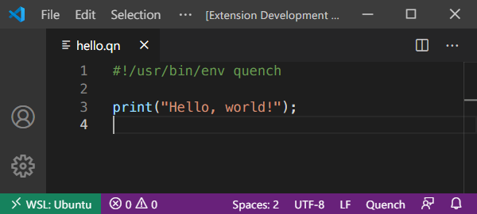

# VS Code extension

Prerequisites:

- [Node][]
- [VS Code][]
- [Quench][]

The below instructions assume that your VS Code workspace is (the root of) this
repo but your shell cwd is this directory (`editors/code` in this repo).

First install dependencies:

```sh
npm install
```

Then compile:

```sh
npm run compile
```

Next, from VS Code, press F5 to open a new window with this extension loaded.
Open a Quench source file (such as `examples/hello.qn` from this repository) and
observe the syntax highlighting:



[node]: https://github.com/nvm-sh/nvm#install--update-script
[quench]: /README.md
[vs code]: https://code.visualstudio.com/download
